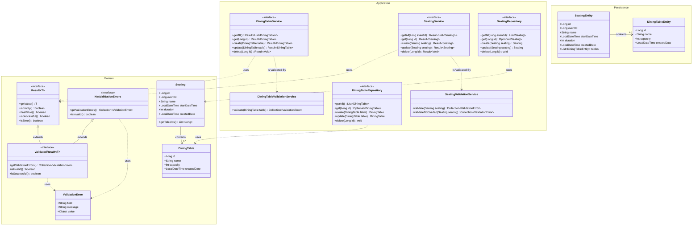

```mermaid

classDiagram
    namespace Domain {

        class Result~T~ {
            <<interface>>
            +getValue() T
            +isEmpty() boolean
            +hasValue() boolean
            +isSuccessful() boolean
            +isError() boolean
        }

        class HasValidationErrors {
            <<interface>>
            +getValidationErrors() Collection~ValidationError~
            +isInvalid() boolean
        }

        class ValidatedResult~T~ {
            <<interface>>
            +getValidationErrors() Collection~ValidationError~
            +isInvalid() boolean
            +isSuccessful() boolean
        }

        class ValidationError {
            +String field
            +String message
            +Object value
        }

        class DiningTable {
            +Long id
            +String name
            +int capacity
            +LocalDateTime createdDate
        }

        class Seating {
            +Long id
            +Long eventId
            +String name
            +LocalDateTime startDateTime
            +int duration
            +LocalDateTime createdDate
            +getTableIds() List~Long~
        }
    }

    namespace Application {

        class DiningTableService {
            <<interface>>
            +getAll() Result~List~DiningTable~~
            +get(Long id) Result~DiningTable~
            +create(DiningTable table) Result~DiningTable~
            +update(DiningTable table) Result~DiningTable~
            +delete(Long id) Result~Void~
        }

        class DiningTableValidationService {
            +validate(DiningTable table) Collection~ValidationError~
        }

        class DiningTableRepository {
            <<interface>>
            +getAll() List~DiningTable~
            +get(Long id) Optional~DiningTable~
            +create(DiningTable table) DiningTable
            +update(DiningTable table) DiningTable
            +delete(Long id) void
        }

        class SeatingService {
            <<interface>>
            +getAll(Long eventId) Result~List~Seating~~
            +get(Long id) Result~Seating~
            +create(Seating seating) Result~Seating~
            +update(Seating seating) Result~Seating~
            +delete(Long id) Result~Void~
        }

        class SeatingValidationService {
            +validate(Seating seating) Collection~ValidationError~
            +validateNoOverlap(Seating seating) Collection~ValidationError~
        }

        class SeatingRepository {
            <<interface>>
            +getAll(Long eventId) List~Seating~
            +get(Long id) Optional~Seating~
            +create(Seating seating) Seating
            +update(Seating seating) Seating
            +delete(Long id) void
        }
    }

    namespace Persistence {

        class DiningTableEntity {
            +Long id
            +String name
            +int capacity
            +LocalDateTime createdDate
        }

        class SeatingEntity {
            +Long id
            +Long eventId
            +String name
            +LocalDateTime startDateTime
            +int duration
            +LocalDateTime createdDate
            +List~DiningTableEntity~ tables
        }
    }

    Seating --> "0..*" DiningTable : contains
    SeatingEntity --> "0..*" DiningTableEntity : contains

    DiningTableService ..> Result : uses
    SeatingService ..> Result : uses

    DiningTableService ..> DiningTableValidationService : Is Validated By
    SeatingService ..> SeatingValidationService : Is Validated By

    Result~T~ <|-- ValidatedResult~T~ : extends
    HasValidationErrors <|-- ValidatedResult~T~ : extends

    HasValidationErrors ..> ValidationError : uses
    ValidatedResult~T~ ..> ValidationError : uses

    DiningTableRepository ..> DiningTable : uses
    SeatingRepository ..> Seating : uses
```